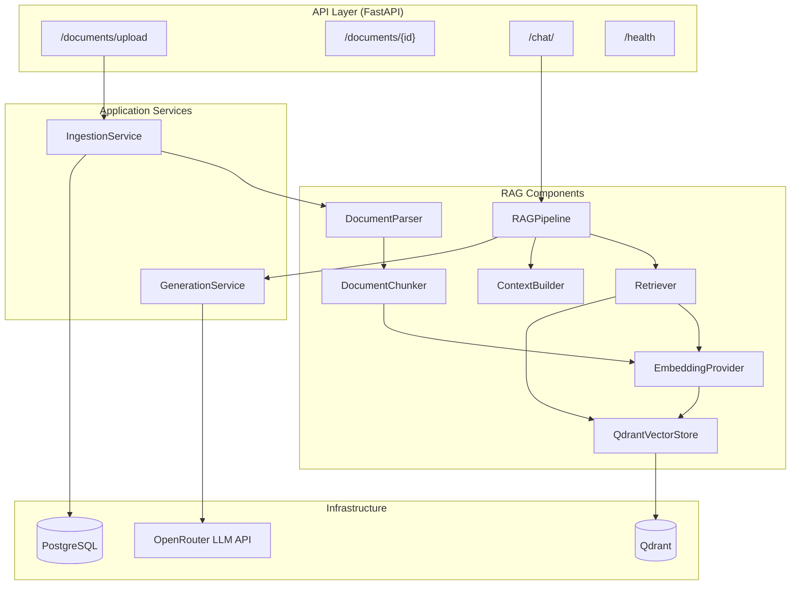

# Architecture — Enterprise RAG Platform (Stage 1)

## Overview

Stage 1 implements a core RAG (Retrieval-Augmented Generation) system with clear separation between API, application services, RAG components, and infrastructure.

---

## Component Architecture



---

## Data Flow

### Ingestion Flow

```text
1. Client uploads file via POST /documents/upload
2. FastAPI route delegates to IngestionService
3. File is validated (type, size) and saved to disk
4. DocumentRecord is created in PostgreSQL (status: uploaded)
5. Status updated to "processing"
6. DocumentParser extracts structured text
     - TXT/MD: Direct file reading
     - PDF/DOCX: Docling DocumentConverter → Markdown
7. DocumentChunker splits text into chunks
     - Respects Markdown heading boundaries
     - Applies configurable chunk_size and chunk_overlap
     - Attaches metadata (document_id, filename, section, page_number)
8. EmbeddingProvider generates vectors for all chunk texts
9. QdrantVectorStore upserts vectors + payload
10. DocumentRecord updated (status: processed, chunk_count: N)
```

### Query Flow

```text
1. Client sends question via POST /chat/
2. FastAPI route delegates to RAGPipeline
3. Retriever embeds the query via EmbeddingProvider
4. Retriever searches Qdrant for top-K similar chunks
5. ContextBuilder constructs a grounded LLM prompt
     - System prompt: strict rules (answer from context only)
     - User message: formatted context chunks + question
6. GenerationService calls OpenRouter LLM API
7. RAGPipeline maps internal RetrievalResults to SourceReferences
8. Response returned: { answer, sources[] }
```

---

## Database Responsibilities

### PostgreSQL

Stores **application metadata**, NOT vectors.

**Documents table:**
- `id` (UUID, primary key)
- `filename`, `original_filename`, `file_type`, `file_size`
- `storage_path` — filesystem path to the uploaded file
- `status` — enum: uploaded → processing → processed / failed
- `chunk_count` — number of chunks after processing
- `error_message` — failure details if status is "failed"
- `created_at`, `updated_at`

**Future RBAC fields** (not yet implemented):
- `owner_id`, `department`, `classification`, `allowed_roles`

### Qdrant

Stores **vectors + payload** for similarity search.

**Collection:** `enterprise_documents`

**Each point contains:**
- `id` — chunk UUID
- `vector` — embedding (384 dimensions for all-MiniLM-L6-v2)
- `payload` — `{text, document_id, filename, section, page_number, source}`

### Why Separate?

- **PostgreSQL** is optimized for relational queries, transactions, and metadata management. It will be the source of truth for document lifecycle, user permissions (future RBAC), and audit trails.
- **Qdrant** is optimized for approximate nearest neighbor (ANN) search on high-dimensional vectors. It should only store what's needed for retrieval.

Mixing these concerns would create an architectural bottleneck and make future extensions (hybrid search, multi-tenancy) significantly harder.

---

## Extension Points

### Future Hybrid Retrieval (Stage 2)

The `Retriever` class is the single point of retrieval logic. To add hybrid search:

1. Create `HybridRetriever` implementing the same interface
2. Add BM25 index alongside Qdrant
3. Combine scores with reciprocal rank fusion
4. Swap via configuration — no API or pipeline changes needed

### Future RBAC (Stage 3)

The `DocumentRecord` model has commented extension points:
```python
# owner_id: Mapped[uuid.UUID | None]
# department: Mapped[str | None]
# classification: Mapped[str | None]
# allowed_roles: Mapped[list[str] | None]
```

The `DocumentRepository` can be extended with filtered queries. Qdrant searches can be filtered by `document_id` to enforce document-level permissions.

### Future Guardrails (Stage 4)

The `RAGPipeline` is the natural injection point:
- **Pre-retrieval:** PII detection on the question
- **Post-retrieval:** Content classification on retrieved chunks
- **Pre-generation:** Prompt injection detection
- **Post-generation:** Output sanitization

### Future Agents (Stage 9)

The `RAGPipeline.answer_question()` method can be wrapped by a LangGraph agent that decides whether to retrieve, search the web, or ask for clarification.

---

## Configuration Management

All configuration flows through `app/core/config.py` using Pydantic `BaseSettings`. No module accesses `os.getenv()` directly.

This ensures:
- Type validation on startup
- Clear documentation of all env vars
- Easy testing with overridden settings
- Single source of truth for defaults

---

## Dependency Injection

`app/core/dependencies.py` provides FastAPI dependencies for:
- Database sessions (per-request, via `yield`)
- Shared singletons (embedding model, Qdrant client, pipeline)

Heavy components (sentence-transformer model, Qdrant client) are lazy-initialized once and reused across requests to avoid repeated model loading.
